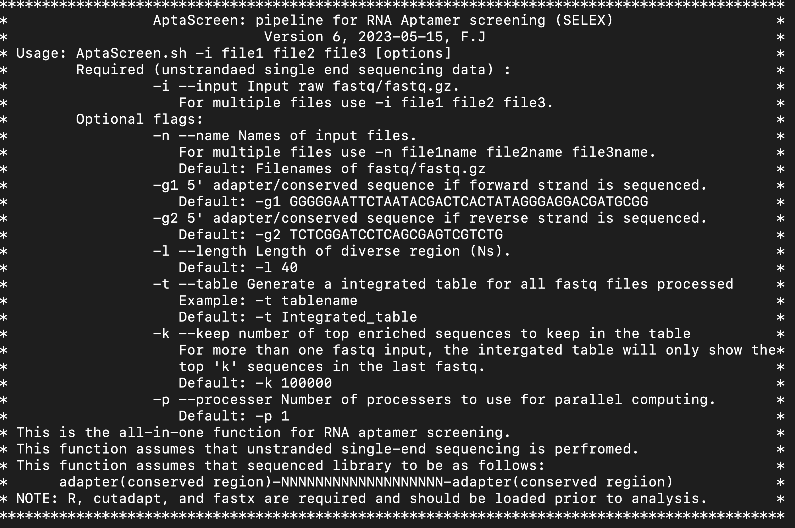

# AptaScreen
A script to screen Aptamer sequences enriched in library following SELEX (Systematic Evolution of Ligands by EXponential Enrichment)

If you use this pipeline, please consider citing it:

1. Jiang, F., Hedaya, O.M., Khor, E., Wu, J., Auguste, M., & Yao, P. (2023). [RNA binding protein PRRC2B mediates translation of specific mRNAs and regulates cell cycle progression](https://academic.oup.com/nar/article/51/11/5831/7147500). _Nucleic Acids Research_, 51(11), 5831–5846

2. Khalid K. Alam, Jonathan L. Chang & Donald H. Burke. [FASTAptamer: A Bioinformatic Toolkit for High-Throughput Sequence Analysis of Combinatorial Selections] Molecular Therapy — Nucleic Acids. 2015. 4, e230; DOI: 10.1038/mtna.2015.4

## Software prerequisites
This pipeline is designed to run on Linux servers, and requires the following software:

They need to be installed and added to the $PATH before using the pipeline.
```
R
fastx
cutadapt
```

In addition, the following R packages are also required. please install them.
```
pillar
dplyr
data.table
ggplot2
tidyr
```

## Pipeline setup

1, Download scripts from github to Linux server:

```
git clone https://github.com/fengjiang94/AptaScreen.git
```

**AptaScreen.sh** is the main script to run.

2. add AptaScreen to $path
```
export PATH=$PATH:/Where AptaScreen is/AptaScreen
```

3, Add executable permissions
```
chmod +x /Where AptaScreen is/AptaScreen/AptaScreen.sh
```

4, cutadapt and dplyr

Occasionally cutadapt and dplyr are not compatible so that we unload cutadapt before loading dplyr in line 292 of **AptaScreen.sh**
```
module unload cutadapt # we have to unload cutadapt since it is not compatible with r-dplyr, whcih is needed for the following steps. This may be a problem with our local cluster only.
```

If you are not encountering this problem or not loading cutadapt as Environment Modules, please remove this line from **AptaScreen.sh** before using.


## Usage

This pipeline can only be sued for unstranded single-end sequencing.                
 
This function requires the sequenced library to be as follows:                           
    **adapter(conserved region)-NNNNNNNNNNNNNNNNNNN-adapter(conserved regiion)**
 
For the manual page:

```
AptaScreen.sh
AptaScreen.sh --help
```

Manual page:



## Examples

A regular run for three screening library round #0 (R0), round #1 (R1), and round #2 (R2) containing the following reads:
     **adapter(conserved region)- NNNNNNNNN (40 N) NNNNNNNNNN -adapter(conserved regiion)**

```
# Raw single-end sequencing data hierarchy
input/
    ├── R0.fastq.gz
    ├── R1.fastq.gz
    ├── R2.fastq.gz

# unzip the input files
gunzip -c R0.fastq.gz > R0.fastq
gunzip -c R1.fastq.gz > R1.fastq
gunzip -c R2.fastq.gz > R2.fastq

# Run RNAseqPE
AptaScreen.sh -i R1_1000.fastq R2_1000.fastq R3_1000.fastq
              -n R0 R1 R2
              -l 40           # length of the Ns in apatmar
              -g1 GGGGGAATTCT # 5' conserved region of the apatamer
              -g2 TCTCGGATCCT # reverse complementary sequence of the 3' conserved region of the apatamer
              -t integrated_result  
              -k 100000       # number of top enriched sequences to keep
              -p 3            # number of processors 
```

After the pipeline finishes, you will get a list of outputs:
```
Outputs/
    ├── R0.fastq.csv # A table containg Aptamer sequences (unconserved region only) and counts in R0
    ├── R0.fastq.trim.processed.combined.count.fasta  # fasta file containg Aptamer sequences (unconserved region only) in R0, header of each sequence: rank-count-RPM(read per million reads)
    ├── R0.fastq.trim.processed.combined.fastq # A fastq file containg Aptamer sequences (unconserved region only). This file is not counted
    ├── R0.fastq.top100000.csv  # A table containg the top 100000 enriched Aptamer sequences (unconserved region only) and counts in R0
    ├── R0.fastq.csv.randomness.csv  # reporting the duplicate level (randomness) of R0 
    ├── R0.fastq.csv.ATGCdistribution.csv  # reporting the ATGC distribution of R0 
    ├── R0.fastq.trim.cutadpt.log  # log for cutadpt
    ├── R1.fastq.csv 
    ├── R1.fastq.trim.processed.combined.count.fasta  
    ├── R1.fastq.trim.processed.combined.fastq 
    ├── R1.fastq.top100000.csv  
    ├── R1.fastq.csv.randomness.csv  
    ├── R1.fastq.csv.ATGCdistribution.csv  
    ├── R1.fastq.trim.cutadpt.log
    ├── R2.fastq.csv 
    ├── R2.fastq.trim.processed.combined.count.fasta  
    ├── R2.fastq.trim.processed.combined.fastq 
    ├── R2.fastq.top100000.csv  
    ├── R2.fastq.csv.randomness.csv  
    ├── R2.fastq.csv.ATGCdistribution.csv  
    ├── R2.fastq.trim.cutadpt.log
    ├── Randomness.csv # reporting  duplicate levels (randomness) of all libraries (R0, R1, R2)
    ├── Randomness.pdf # A lineplot reporting  duplicate levels (randomness) of all libraries (R0, R1, R2)
    ├── Randomness_barplot.pdf # A barplot reporting  duplicate levels (randomness) of all libraries (R0, R1, R2)
    ├── Randomness_barplot.csv # data for the barplot  
    ├── reads_number_report.csv # reporting the depth of each library  
    ├── integrated_result.top100000.csv # A summerized table containing the top 100000 enriched Aptamer sequences (unconserved region only) in R2 and theirs counts in R0, R1, and R2.
    ├── R.log # R console
```

Usually, **integrated_result.top100000.csv** is the most useful output data.
